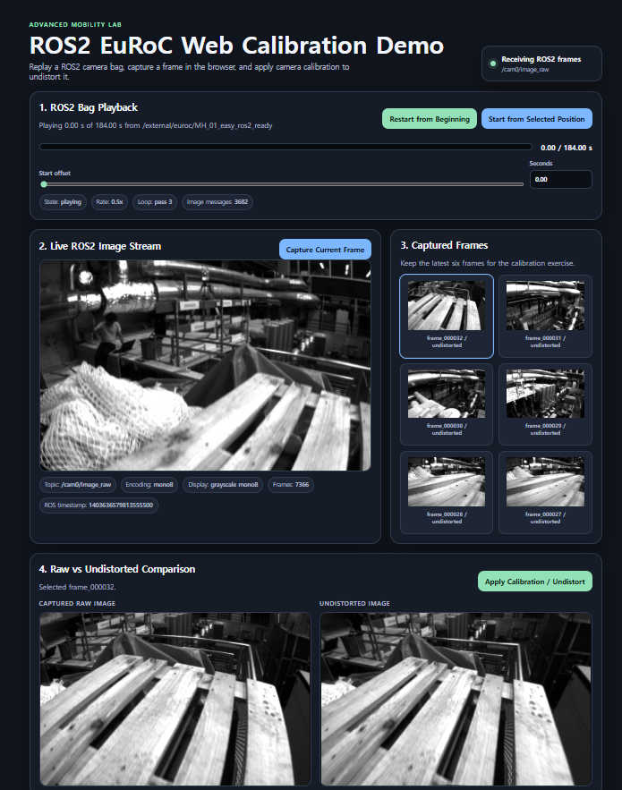

# ROS2 EuRoC Web Calibration Lab

A Dockerized ROS2 Jazzy lab for an Advanced Mobility class.

This repository assumes the class dataset is already prepared as a **ROS2 bag**. The container does not prepare a dataset during build. It simply runs `ros2 bag play` on the mounted ROS2 bag and serves the browser calibration lab.

## Current Class Dataset

The prepared ROS2 bag is:

```text
external/euroc/MH_01_easy_ros2_ready/
```

Expected topics:

```text
/cam0/image_raw      sensor_msgs/msg/Image       3682 messages
/cam0/camera_info    sensor_msgs/msg/CameraInfo  3682 messages
```

The default runtime path inside Docker is:

```text
/external/euroc/MH_01_easy_ros2_ready
```

This is configured in `.env`:

```env
BAG_PATH=/external/euroc/MH_01_easy_ros2_ready
BAG_RATE=0.5
BAG_AUTO_DOWNLOAD=1
BAG_DRIVE_URL=https://drive.google.com/drive/folders/1IGENwyRNQZgeNes16DeYKq9V2stf7NzN?usp=sharing
```

If `external/euroc/MH_01_easy_ros2_ready/metadata.yaml` is missing, the container automatically downloads the ROS2 bag from the Google Drive folder above and saves it under `external/euroc/`.

## One-Command Demo

From this repository root:

```bash
docker compose up --build
```

Open:

```text
http://localhost:8080
```

The web bridge manages `ros2 bag play`, streams `/cam0/image_raw`, reads calibration from `/cam0/camera_info`, lets the user capture frames, and applies undistortion.

## Example Web Lab Screen

The browser shows ROS2 bag playback progress, the live `/cam0/image_raw` stream, the latest captured frames, and a raw-vs-undistorted comparison after calibration is applied.



## Student Workflow

1. Watch the ROS2 bag playback status at the top of the page.
2. Use **Restart from Beginning** or **Start from Selected Position** if needed.
3. Click **Capture Current Frame**.
4. Pick one of the latest six captured frames.
5. Click **Apply Calibration / Undistort**.
6. Compare raw and undistorted images.

Saved files appear under:

```text
saved/raw/
saved/metadata/
saved/undistorted/
```

Only the latest six captured frames are kept for the browser exercise.

## Useful Commands

```bash
# Start the lab
docker compose up --build

# Stop and remove the container
docker compose down

# Follow logs
docker compose logs -f

# Enter a ROS2 shell in the container
docker compose run --rm ros2-web-lab shell

# Inspect the mounted ROS2 bag
docker compose run --rm ros2-web-lab bag-info

# Download the ROS2 bag without starting the web app
docker compose run --rm ros2-web-lab download-bag
```

Inside the container shell:

```bash
source /opt/ros/jazzy/setup.bash
source /ros2_ws/install/setup.bash
ros2 topic list
ros2 topic info /cam0/image_raw
ros2 topic info /cam0/camera_info
ros2 topic hz /cam0/image_raw
ros2 bag info /external/euroc/MH_01_easy_ros2_ready
```

## Repository Layout

```text
.
|-- Dockerfile
|-- docker-compose.yml
|-- .env
|-- Makefile
|-- scripts/
|   |-- entrypoint.sh
|   |-- download_ros2_bag.sh
|   `-- healthcheck.sh
|-- ros2_ws/src/euroc_web_lab/
|   |-- package.xml
|   |-- setup.py
|   |-- launch/demo.launch.py
|   `-- euroc_web_lab/
|       |-- calibration.py
|       |-- web_bridge_node.py
|       `-- static/
|           |-- index.html
|           |-- app.js
|           `-- styles.css
|-- external/euroc/MH_01_easy_ros2_ready/
|   |-- metadata.yaml
|   `-- MH_01_easy_ros2_ready.db3
`-- saved/
```

## Runtime Graph

```text
ros2 bag play /external/euroc/MH_01_easy_ros2_ready
        |
        | publishes /cam0/image_raw and /cam0/camera_info
        v
euroc_image_web_bridge
        |
        | MJPEG stream + HTTP API
        v
Browser UI at http://localhost:8080
        |
        | capture + undistort
        v
saved/raw, saved/metadata, saved/undistorted
```

## Web API

```text
GET  /                         browser UI
GET  /health                   container health check
GET  /stream.mjpg              live MJPEG image stream
GET  /api/status               latest ROS2 frame, bag, and calibration status
GET  /api/bag                  bag playback status
POST /api/bag/restart          restart bag playback from the beginning
POST /api/bag/seek             restart bag playback from a selected offset
GET  /api/saved                latest saved image list
POST /api/capture              save current raw frame and JSON metadata
POST /api/undistort/{image_id} save undistorted image
```

## Calibration Model

The app reads camera calibration from `/cam0/camera_info` in the ROS2 bag. The current EuRoC cam0 values are:

```text
fx = 458.654
fy = 457.296
cx = 367.215
cy = 248.375
D  = [-0.28340811, 0.07395907, 0.00019359, 0.0000176187114, 0.0]
```

The model is pinhole projection with radial-tangential distortion:

```text
x = X/Z, y = Y/Z, r^2 = x^2 + y^2
x_d = x(1 + k1 r^2 + k2 r^4 + k3 r^6) + 2 p1 x y + p2(r^2 + 2x^2)
y_d = y(1 + k1 r^2 + k2 r^4 + k3 r^6) + p1(r^2 + 2y^2) + 2 p2 x y
u_d = fx x_d + cx
v_d = fy y_d + cy
```

Undistortion uses OpenCV remapping:

```python
map_x, map_y = cv2.initUndistortRectifyMap(K, D, None, new_K, image_size, cv2.CV_32FC1)
undistorted = cv2.remap(raw, map_x, map_y, interpolation=cv2.INTER_LINEAR)
```

## Troubleshooting

### Browser opens but no image appears

Check that the ROS2 bag exists and has metadata:

```bash
dir external\euroc\MH_01_easy_ros2_ready
docker compose run --rm ros2-web-lab bag-info
```

Then check logs:

```bash
docker compose logs -f
```

### The app says the bag path does not exist

Make sure `.env` points to a bag mounted under `./external/euroc`:

```env
BAG_PATH=/external/euroc/MH_01_easy_ros2_ready
BAG_AUTO_DOWNLOAD=1
BAG_DRIVE_URL=https://drive.google.com/drive/folders/1IGENwyRNQZgeNes16DeYKq9V2stf7NzN?usp=sharing
```

Then run:

```bash
docker compose run --rm ros2-web-lab download-bag
```

If Google Drive quota or network access blocks the download, manually place these two files under `external/euroc/MH_01_easy_ros2_ready/`:

```text
metadata.yaml
MH_01_easy_ros2_ready.db3
```

### Port 8080 is busy

```bash
WEB_PORT=8081 docker compose up --build
```

Open:

```text
http://localhost:8081
```

## Codex Setup Prompt

```text
Read README.md first. Do not install ROS2 on the host machine. Use the prepared ROS2 bag at external/euroc/MH_01_easy_ros2_ready. If it is missing, let Docker Compose download it from BAG_DRIVE_URL. Make the Docker demo run with docker compose up --build, then open http://localhost:8080. Do not convert EuRoC during class.
```

## References

- ROS2 Jazzy distribution: https://docs.ros.org/en/jazzy/Releases.html
- ROS2 bag tutorial: https://docs.ros.org/en/rolling/Tutorials/Beginner-CLI-Tools/Recording-And-Playing-Back-Data/Recording-And-Playing-Back-Data.html
- ROS2 CameraInfo message: https://docs.ros.org/en/jazzy/p/sensor_msgs/msg/CameraInfo.html
- EuRoC MAV dataset: https://projects.asl.ethz.ch/datasets/euroc-mav/
- OpenCV camera calibration: https://docs.opencv.org/3.4/d4/d94/tutorial_camera_calibration.html
